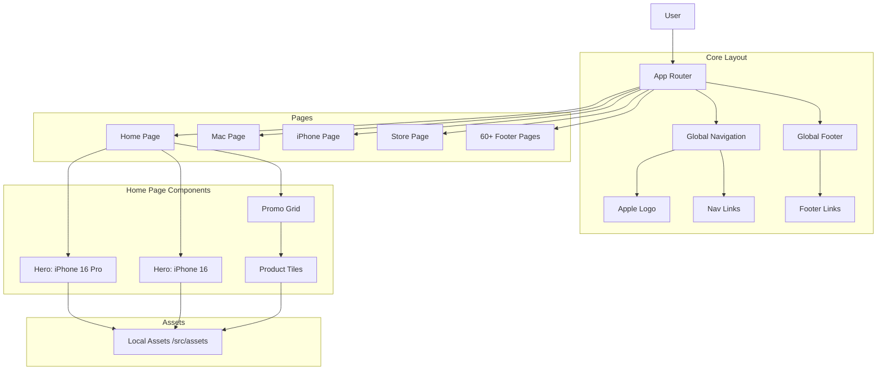

# Apple.com High-Fidelity Clone

This project is a high-fidelity clone of Apple.com, featuring pixel-perfect components, responsive design, and over 60 dedicated pages mirroring the official structure.

## 👨‍💻 Developed By

**[black12-ag](https://github.com/black12-ag)**

> This project is open-source and available for educational purposes. If you find it useful, please consider [sponsoring](https://github.com/sponsors/black12-ag).

## 🏗️ Architecture

## 🚀 Deployment Instructions (Cloudflare Pages)

1.  **Connect Git:** Connect your GitHub repository (`black12-ag/apple.com`) to Cloudflare Pages.
2.  **Build Settings:** Cloudflare should automatically detect the framework as **Vite**.
    *   **Build Command:** `npm run build`
        *   *Note:* The build script runs `tsc -b && vite build`.
    *   **Output Directory:** `dist`
3.  **Environment Variables:** None required for this static build.
4.  **Node Version:** Recommended `20` or later.

## 🛠️ Tech Stack

-   **Framework:** React + Vite
-   **Routing:** React Router DOM
-   **Styling:** Styled Components + Framer Motion
-   **Language:** TypeScript

## 📜 License

Copyright © 2025 Apple Inc. Clone developed by black12-ag.
